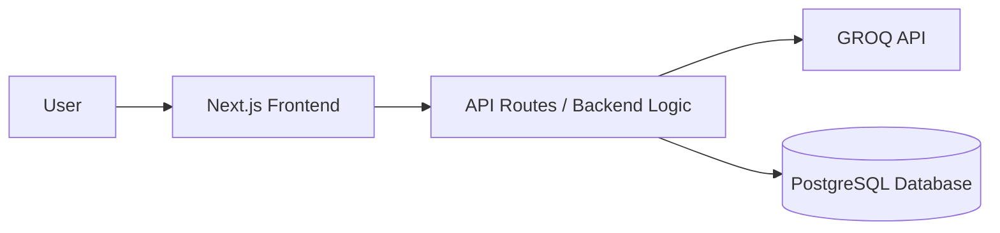

# ChatBot Platform with PostgreSQL Backend

A modern chatbot platform built with **Next.js** for the frontend, **PostgreSQL** for persistent data storage, and **Docker** for containerized deployment. The platform supports conversational AI features, real-time chat UI, and efficient database management.  

## 📌 Table of Contents
- [ChatBot Platform with PostgreSQL Backend](#chatbot-platform-with-postgresql-backend)
  - [📌 Table of Contents](#-table-of-contents)
  - [Overview](#overview)
  - [Features](#features)
  - [Architecture](#architecture)
  - [Tech Stack](#tech-stack)
  - [Installation](#installation)
    - [1. Clone the repository](#1-clone-the-repository)
    - [2. Configure environment variables](#2-configure-environment-variables)
  - [Development](#development)
    - [Start services](#start-services)
    - [Stop services](#stop-services)
  - [Production Deployment](#production-deployment)
    - [Start services](#start-services-1)
    - [Stop services](#stop-services-1)
  - [Database Management](#database-management)
    - [Connect to PostgreSQL inside the container](#connect-to-postgresql-inside-the-container)
  - [License](#license)

---

## Overview
This project is designed to deliver a **production-grade chatbot application** with:
- A **high-performance frontend** built in Next.js with typescript.
- **PostgreSQL database** for storing user conversations, threads, and configurations.
- **Docker Compose setup** for both development and production environments.
- **FASTAPI** backend for api. Implemented using langgraph.
- Scalable architecture with clear separation of concerns.

---

## Features
- 💬 Real-time chat interface with conversation history.
- 🗄 Persistent storage in PostgreSQL.
- 🌐 API-driven backend endpoints for message handling.
- 🐳 Docker-based local development and deployment.
- 📊 Sidebar with conversation thread list.
- ⚡ Caching strategies for better performance.

---

## Architecture


---

## Tech Stack
- **Frontend**: Next.js 15+
- **Backend**: FASTAPI 
- **Database**: PostgreSQL 17+
- **Containerization**: Docker & Docker Compose
- **Environment Management**: `.env` files

---

## Installation

### 1. Clone the repository
```bash
git clone https://github.com/BiswajitAich/lang-bot.git
```

### 2. Configure environment variables
Create a `.env` file:

- Inside `.`
```env
DB_NAME=
DB_USER=
DB_PASSWORD=
```

- Inside `frontend`
```env
REDIS_USERNAME=
REDIS_PASSWORD=
REDIS_HOST=
REDIS_PORT=


EMAIL_USER=
EMAIL_PASS=

JWT_SECRET=
DOCKER_BACKEND_URL=
```

- Inside `backend`
```env
GROQ_API_KEY=
DB_HOST=
DB_NAME=
DB_USER=
DB_PASSWORD=
DB_PORT=
```

You can checkout **backend** container in GHCR <small>[click here](https://github.com/users/BiswajitAich/packages/container/package/lang-bot-api)</small>

You can checkout **frontend** container in GHCR <small>[click here](https://github.com/users/BiswajitAich/packages/container/package/lang-bot)</small>

---

## Development

### Start services
```bash
docker-compose -f docker-compose.dev.yml up --build
```

### Stop services
```bash
docker-compose -f docker-compose.dev.yml down
```

---

## Production Deployment

### Start services
```bash
docker-compose -f docker-compose.prod.yml up --build 
```

### Stop services
```bash
docker-compose -f docker-compose.prod.yml down
```

---

## Database Management

### Connect to PostgreSQL inside the container
```bash
docker ps
# copt db-1
docker exec -it db-1
psql -U postgres
```


---

## License
This project is licensed under the MIT License.
